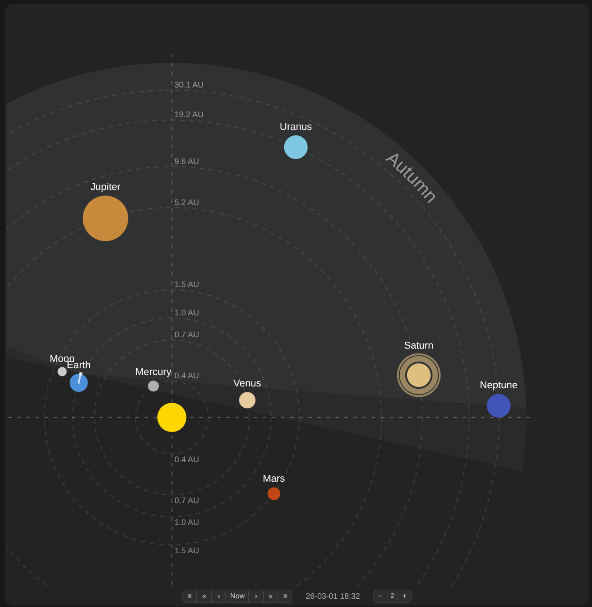

## Summary

Home Assistant custom Lovelace card (`ha-solar-view-card`) that displays a planetary solar system. 

Shows alignment of all 8 planets and Moon centered on the Sun for a given date, with interactive navigation (day/month forward/back, return to today).

It automatically updates the view every 60 seconds.

## Development

This is AI generated project with use of specification ([openspec](https://github.com/Fission-AI/OpenSpec)) to implement enhacement or fix issues. 

More on development in [CLAUDE.md](CLAUDE.md).

## Installation

This can be installed in Home Assistant as:
- copy JavaScript file (dist/ha-solar-view-card.js) to the folder: `<config directory>/www/ha-solar-view-card/ha-solar-view-card.js` i.e. via Terminal.
- add the following to your Home Assistant Dashboard resources configuration:

    ```yaml
    resources:
    - url: /local/ha-solar-view-card/ha-solar-view-card.js?hacstag=1
      type: JavaScript Module
    ```
- restart Home Assistant
- on dashboard card, add below to complete the visualization:

    ```yaml
    - type: custom:ha-solar-view-card
      default_zoom: 2
    ```

### Example:



## TODO:

### Features
- orbit around Moon
- add some other object like comets i.e. Halley
- add Earth centric view (every update should move all objects except Earth)
- add moon phases
- add information if this Northern or Southern hemisphere
- add auto zoom level to fit all planets in view
- add changing zoom level every n minutes
- add configurations options:
  - refresh time, default: 60 seconds 
  - zoom level to fit all planets, default: false
  - centric view, default: Sun (or Earth)

### Fixes
- sometimes Moon is on Venus position
- card background is too dark
