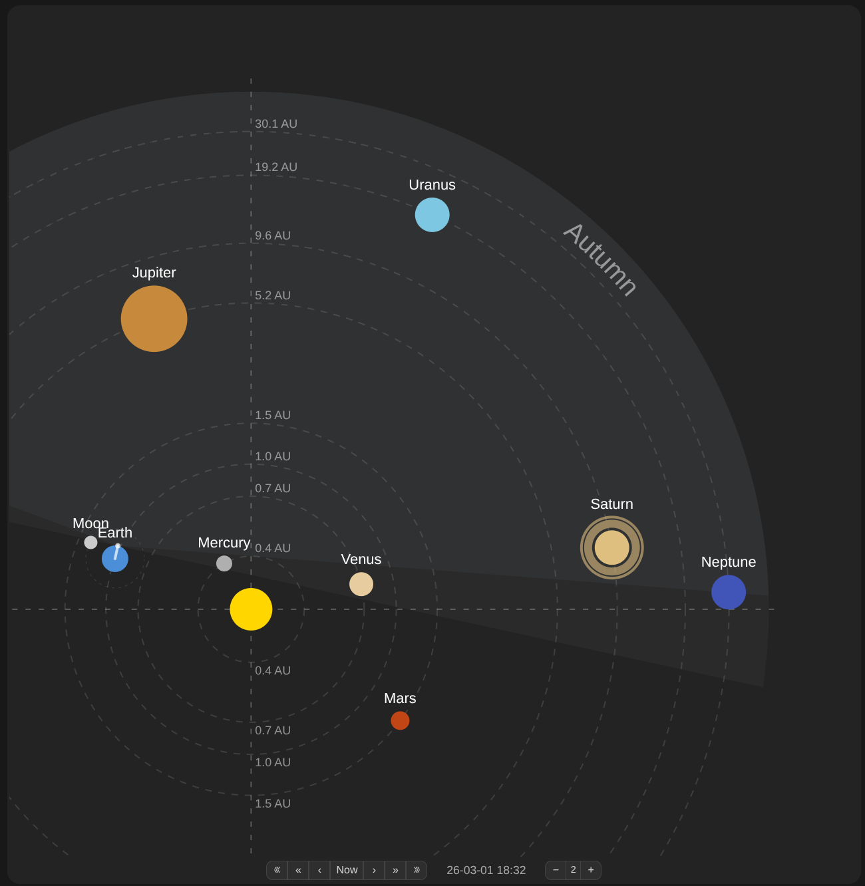

# ha-solar-view-card

Home Assistant custom Lovelace card showing all 8 planets, Moon and comet Halley aligned around the
Sun. Navigate time, zoom, and pan interactively.

## Demo

[**→ Try the interactive demo**](https://marcintk.github.io/ha-planetary-solar-system-card/)

[](https://marcintk.github.io/ha-planetary-solar-system-card/)

## Installation

1. Copy `dist/ha-solar-view-card.js` to `<config>/www/ha-solar-view-card/ha-solar-view-card.js`

2. Add to Dashboard resources:
   ```yaml
   resources:
     - url: /local/ha-solar-view-card/ha-solar-view-card.js
       type: JavaScript Module
   ```
3. Restart Home Assistant

4. Add the card:
   ```yaml
   type: custom:ha-solar-view-card
   default_zoom: 2
   ```

## Configuration

Configuration (YAML in HA)

- **refresh_mins**: auto-update interval in minutes (default: 1)
- **periodic_zoom_change**: cycle zoom levels on each refresh tick (default: false)
- **periodic_zoom_max**: maximum zoom level for auto-cycle, 2–4 (default: 4)
- **default_zoom**: starting zoom level (default: 1)
- **zoom_animate**: animate zoom in and out (default: true)

## Development

AI-generated using [OpenSpec](https://github.com/Fission-AI/OpenSpec). See [CLAUDE.md](CLAUDE.md)
for details.
