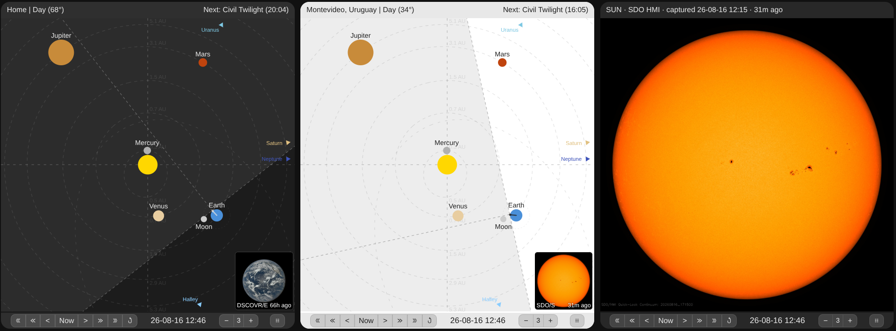

# Planetary Solar System Card

[](https://hacs.xyz)
[](https://github.com/marcintk/ha-planetary-solar-system-card/releases)
[](https://github.com/marcintk/ha-planetary-solar-system-card/blob/main/LICENSE)

[](https://github.com/marcintk/ha-planetary-solar-system-card/actions/workflows/build-and-test.yml)
[](https://github.com/marcintk/ha-planetary-solar-system-card)
[](https://github.com/marcintk/ha-planetary-solar-system-card/actions/workflows/build-and-test.yml)

Home Assistant custom Lovelace card showing all 8 planets, Moon and comet Halley aligned around the
Sun. Navigate time, zoom, and pan interactively.

Have an idea or found a bug?
[Open a GitHub issue](https://github.com/marcintk/ha-planetary-solar-system-card/issues/new).

## Preview

[**→ Try the interactive demo**](https://marcintk.github.io/ha-planetary-solar-system-card/)

[](https://marcintk.github.io/ha-planetary-solar-system-card/)

### Horizon Twilight Zones

The visibility cone at Earth's orbit shades by how far the Sun is below your local horizon, using
the standard astronomical twilight definitions:

| Zone                  | Sun elevation | Meaning                                                          |
| --------------------- | ------------- | ---------------------------------------------------------------- |
| Day                   | ≥ 0°          | Sun is up                                                        |
| Civil twilight        | 0° to -6°     | Bright enough for outdoor activity without lights                |
| Nautical twilight     | -6° to -12°   | Horizon still visible at sea; too dark for most outdoor activity |
| Astronomical twilight | -12° to -18°  | Sky background glow, faint stars washed out                      |
| Night                 | < -18°        | Full dark; the Sun no longer lights the sky                      |

### Live Imagery

Live imagery from two NASA probes: [DSCOVR](https://epic.gsfc.nasa.gov/) and
[SDO](https://sdo.gsfc.nasa.gov/). `gallery.mode` picks what shows (☷ toggles the strip, a
thumbnail click opens full-screen):

| Mode    | Strip shows                                                 |
| ------- | ----------------------------------------------------------- |
| `none`  | Nothing — gallery button hidden                             |
| `earth` | Earth only                                                  |
| `sun`   | Sun only                                                    |
| `both`  | Earth and Sun together                                      |
| `slide` | One thumbnail, flipping every `gallery.slide_interval_secs` |

| Thumbnail | Source                                                              | We poll     | Latest image is usually                 |
| --------- | ------------------------------------------------------------------- | ----------- | --------------------------------------- |
| DSCOVR/E  | [NASA EPIC](https://epic.gsfc.nasa.gov/) (DSCOVR, at Sun-Earth L1)  | Hourly      | ~1-2 days old (EPIC processing backlog) |
| SDO/S     | [NASA SDO](https://sdo.gsfc.nasa.gov/) (geosynchronous Earth orbit) | Every 15min | ~15-30min old                           |

Strict reverse-proxy CSP may block `epic.gsfc.nasa.gov` / `sdo.gsfc.nasa.gov` — not fixable
card-side.

## Installation

### Via HACS (recommended)

1. In HACS → Frontend → search **Planetary Solar System Card** → Install
2. Reload your browser
3. Add the card to your dashboard (see Configuration below)

### Manual

1. Download `card.js` from the
   [latest release](https://github.com/marcintk/ha-planetary-solar-system-card/releases/latest)
2. Copy it to `<config>/www/ha-planetary-solar-system-card/card.js` (create the folder if needed)
3. In Home Assistant → Settings → Dashboards → Resources → **Add resource**
   - URL: `/local/ha-planetary-solar-system-card/card.js`
   - Type: **JavaScript Module**
4. Reload your browser

## Usage

Add the card to your dashboard:

```yaml
type: custom:ha-planetary-solar-system-card
default_zoom: 2
```

```yaml
type: custom:ha-planetary-solar-system-card
colors:
  background: "#0d1117"
  orbit: "rgba(100, 200, 255, 0.2)"
  label: "#e0e0ff"
```

```yaml
type: custom:ha-planetary-solar-system-card
gallery:
  mode: slide
  slide_interval_secs: 30
```

## Configuration

### Layout

| Option         | Type                                    | Default  | Description                                                                                                                   |
| -------------- | --------------------------------------- | -------- | ----------------------------------------------------------------------------------------------------------------------------- |
| `height`       | `"auto"` \| number \| `"Npx"` \| `"N%"` | `"auto"` | `"auto"` = square, sized to card width. Number/`"Npx"` caps height, shrinks to fit. `"N%"` sets height as a fraction of width |
| `refresh_mins` | number                                  | `1`      | Auto-update interval in minutes                                                                                               |

### Zoom

| Option                 | Type    | Default | Description                             |
| ---------------------- | ------- | ------- | --------------------------------------- |
| `default_zoom`         | number  | `1`     | Starting zoom level                     |
| `zoom_animate`         | boolean | `true`  | Animate zoom transitions                |
| `periodic_zoom_change` | boolean | `false` | Cycle zoom levels on each refresh tick  |
| `periodic_zoom_max`    | number  | `4`     | Maximum zoom level for auto-cycle (2–4) |

### Appearance

| Option          | Type                              | Default   | Description                                                                                                                        |
| --------------- | --------------------------------- | --------- | ---------------------------------------------------------------------------------------------------------------------------------- |
| `theme`         | `"auto"` \| `"dark"` \| `"light"` | `"auto"`  | `"auto"` follows the HA theme. `"dark"`/`"light"` forces a built-in background/text pair regardless of the installed theme         |
| `colors`        | object                            | see below | Color overrides (see Colors)                                                                                                       |
| `ecliptic_view` | `"north"` \| `"south"`            | `"north"` | Viewing pole: `"north"` = counter-clockwise orbits (default); `"south"` = clockwise orbits                                         |
| `show_version`  | boolean                           | `false`   | Show card version number centered in the top status bar (hidden when the status bar itself is hidden, e.g. no location configured) |

### Features

| Option     | Type   | Default   | Description                                |
| ---------- | ------ | --------- | ------------------------------------------ |
| `gallery`  | object | see below | Live Imagery gallery options (see Gallery) |
| `location` | object | see below | Location override (see Location)           |

### Colors

| Key                                 | Default                            | Description                                            |
| ----------------------------------- | ---------------------------------- | ------------------------------------------------------ |
| `colors.background`                 | HA theme (`--ha-card-background`)  | Card background                                        |
| `colors.orbit`                      | 12% of theme text color (adaptive) | Orbit ring and moon-orbit stroke                       |
| `colors.label`                      | theme text color (adaptive)        | Planet and comet name labels                           |
| `colors.season_line`                | 25% of theme text color (adaptive) | Season quadrant divider lines                          |
| `colors.season_label`               | 50% of theme text color (adaptive) | Season name labels (curved arc text)                   |
| `colors.cone_day`                   | 8% of theme text color (adaptive)  | Visibility cone — Sun above horizon                    |
| `colors.cone_twilight_civil`        | `rgba(255, 220, 160, 0.09)`        | Visibility cone — civil twilight (0° to -6°)           |
| `colors.cone_twilight_nautical`     | `rgba(90, 130, 180, 0.12)`         | Visibility cone — nautical twilight (-6° to -12°)      |
| `colors.cone_twilight_astronomical` | `rgba(70, 50, 130, 0.18)`          | Visibility cone — astronomical twilight (-12° to -18°) |
| `colors.cone_night`                 | `rgba(30, 20, 60, 0.22)`           | Visibility cone — Sun below -18°                       |

### Gallery

| Key                           | Type   | Default  | Description                                                                                   |
| ----------------------------- | ------ | -------- | --------------------------------------------------------------------------------------------- |
| `gallery.mode`                | string | `"none"` | `"none"` \| `"earth"` \| `"sun"` \| `"both"` \| `"slide"` — see [Live Imagery](#live-imagery) |
| `gallery.slide_interval_secs` | number | `60`     | How often `slide` mode flips the displayed thumbnail                                          |

### Location

| Key                  | Type                 | Default   | Description                                                                                                  |
| -------------------- | -------------------- | --------- | ------------------------------------------------------------------------------------------------------------ |
| `location.latitude`  | number (-90 to 90)   | HA config | Overrides HA's latitude for hemisphere/season/twilight math. Requires `location.longitude` too, else ignored |
| `location.longitude` | number (-180 to 180) | HA config | Overrides HA's longitude. Requires `location.latitude` too, else ignored                                     |
| `location.name`      | string               | HA config | Overrides the location label shown in the status bar                                                         |
