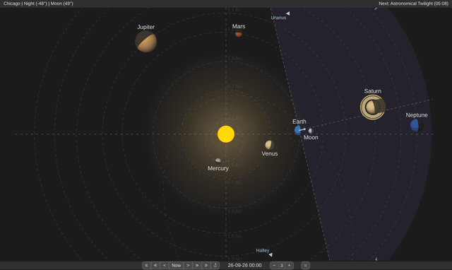

# Planetary Solar System Card

<!-- docs/hero.png is unreferenced on purpose: it is the 1280x640 GitHub social-preview asset,
     uploaded manually under Settings -> General -> Social preview. -->

[](https://marcintk.github.io/ha-planetary-solar-system-card/)

Home Assistant custom Lovelace card showing all 8 planets, Moon and comet Halley aligned around the
Sun, with live NASA imagery of Earth and the Sun. Navigate time, zoom, and pan interactively.

[](https://marcintk.github.io/ha-planetary-solar-system-card/)

Have an idea or found a bug?
[Open a GitHub issue](https://github.com/marcintk/ha-planetary-solar-system-card/issues/new).

[![hacs_badge][hacs-shield]][hacs] [![GitHub Release][releases-shield]][releases]
[![License][license-shield]](LICENSE) ![Maintenance][maintenance-shield] [![CI][ci-shield]][ci]
[![Coverage][coverage-shield]][ci] [![Lines of code][sloc-shield]][repo]

## Horizon Twilight Zones

The visibility cone at Earth's orbit shades by how far the Sun is below your local horizon, using
the standard astronomical twilight definitions:

| Zone                  | Sun elevation | Meaning                                                          |
| --------------------- | ------------- | ---------------------------------------------------------------- |
| Day                   | ≥ 0°          | Sun is up                                                        |
| Civil twilight        | 0° to -6°     | Bright enough for outdoor activity without lights                |
| Nautical twilight     | -6° to -12°   | Horizon still visible at sea; too dark for most outdoor activity |
| Astronomical twilight | -12° to -18°  | Sky background glow, faint stars washed out                      |
| Night                 | < -18°        | Full dark; the Sun no longer lights the sky                      |

## Live Imagery

Near-real-time photos of Earth and the Sun from two NASA probes, in a thumbnail strip beside the
solar view. Off by default — turn it on with `gallery.*` (see [Gallery](#gallery)). Once on, ☷
toggles the strip and clicking a thumbnail opens it full-screen.

| Thumbnail | Source            | Watches                      | We poll | Typical age |
| --------- | ----------------- | ---------------------------- | ------- | ----------- |
| DSCOVR/E  | [NASA EPIC][epic] | Earth's sunlit side, from L1 | Hourly  | 1-2 days    |
| SDO/S     | [NASA SDO][sdo]   | The Sun, from geosync orbit  | 15 min  | 20-55 min   |

Both lags are NASA's publish pipeline, not the card holding images back: EPIC processes a day or two
behind, and SDO's archive often posts a 15-min frame 30+ minutes late, so the card falls back one
frame.

> **Thumbnails stuck on "unavailable"?** The browser fetches these images straight from NASA, so a
> reverse proxy in front of Home Assistant (Nginx Proxy Manager, Cloudflare Tunnel, Traefik) can
> block them with a strict `Content-Security-Policy`. Add `epic.gsfc.nasa.gov` and
> `sdo.gsfc.nasa.gov` to that policy's `img-src`. Nothing card-side can work around it — the block
> happens before the card sees a response.

## Installation

### Via HACS (recommended)

[![Open your Home Assistant instance and open a repository inside the Home Assistant Community Store.][my-hacs-shield]][my-hacs]

Click the badge to open this card in your own HACS, or find it manually: HACS → Frontend → search
**Planetary Solar System Card**. Then Install, reload your browser, and add the card to your
dashboard (see Configuration below).

### Manual

1. Download `card.js` from the
   [latest release](https://github.com/marcintk/ha-planetary-solar-system-card/releases/latest)
2. Copy it to `<config>/www/ha-planetary-solar-system-card/card.js` (create the folder if needed)
3. In Home Assistant → Settings → Dashboards → Resources → **Add resource**
   - URL: `/local/ha-planetary-solar-system-card/card.js`
   - Type: **JavaScript Module**
4. Reload your browser

## Usage

Add the card to your dashboard:

```yaml
type: custom:ha-planetary-solar-system-card
default_zoom: 2
```

```yaml
type: custom:ha-planetary-solar-system-card
colors:
  background: "#0d1117"
  season_line: "rgba(100, 200, 255, 0.2)"
  season_label: "#e0e0ff"
```

```yaml
type: custom:ha-planetary-solar-system-card
gallery:
  mode: slide
  slide_interval_secs: 30
```

```yaml
type: custom:ha-planetary-solar-system-card
location:
  latitude: 51.5074
  longitude: -0.1278
  name: London
```

## Configuration

### Layout

| Option         | Type                                    | Default  | Description                                                                                                                   |
| -------------- | --------------------------------------- | -------- | ----------------------------------------------------------------------------------------------------------------------------- |
| `height`       | `"auto"` \| number \| `"Npx"` \| `"N%"` | `"auto"` | `"auto"` = square, sized to card width. Number/`"Npx"` caps height, shrinks to fit. `"N%"` sets height as a fraction of width |
| `refresh_mins` | number                                  | `1`      | Auto-update interval in minutes                                                                                               |

### Zoom

| Option                 | Type    | Default | Description                             |
| ---------------------- | ------- | ------- | --------------------------------------- |
| `default_zoom`         | number  | `1`     | Starting zoom level                     |
| `zoom_animate`         | boolean | `true`  | Animate zoom transitions                |
| `periodic_zoom_change` | boolean | `false` | Cycle zoom levels on each refresh tick  |
| `periodic_zoom_max`    | number  | `4`     | Maximum zoom level for auto-cycle (2–4) |

### Appearance

| Option          | Type                              | Default   | Description                                                                                                                |
| --------------- | --------------------------------- | --------- | -------------------------------------------------------------------------------------------------------------------------- |
| `theme`         | `"auto"` \| `"dark"` \| `"light"` | `"auto"`  | `"auto"` follows the HA theme. `"dark"`/`"light"` forces a built-in background/text pair regardless of the installed theme |
| `colors`        | object                            | see below | Color overrides (see Colors)                                                                                               |
| `ecliptic_view` | `"north"` \| `"south"`            | `"north"` | Viewing pole: `"north"` = counter-clockwise orbits; `"south"` = clockwise orbits                                           |
| `show_version`  | boolean                           | `false`   | Show card version number centered in the top status bar                                                                    |
| `debug`         | boolean                           | `false`   | Show a live overlay of gallery fetch/cache stats per NASA source (refreshes, cache hits, retries, failures)                |

### Colors

| Key                                 | Default                           | Description                          |
| ----------------------------------- | --------------------------------- | ------------------------------------ |
| `colors.background`                 | HA theme (`--ha-card-background`) | Card background                      |
| `colors.season_line`                | 25% of theme text color           | Season quadrant divider lines        |
| `colors.season_label`               | 50% of theme text color           | Season name labels (curved arc text) |
| `colors.cone_day`                   | 8% of theme text color            | Visibility cone — Sun above horizon  |
| `colors.cone_twilight_civil`        | `rgba(255, 220, 160, 0.09)`       | Civil twilight (0° to -6°)           |
| `colors.cone_twilight_nautical`     | `rgba(90, 130, 180, 0.12)`        | Nautical twilight (-6° to -12°)      |
| `colors.cone_twilight_astronomical` | `rgba(70, 50, 130, 0.18)`         | Astronomical twilight (-12° to -18°) |
| `colors.cone_night`                 | `rgba(30, 20, 60, 0.22)`          | Night (Sun below -18°)               |

### Gallery

`gallery` (object, unset by default) — Live Imagery gallery options:

| Key                           | Type   | Default  | Description                                                                                                        |
| ----------------------------- | ------ | -------- | ------------------------------------------------------------------------------------------------------------------ |
| `gallery.mode`                | string | `"none"` | `"none"` hides the gallery button. `"earth"`/`"sun"`/`"both"` show that thumbnail. `"slide"` flips between the two |
| `gallery.slide_interval_secs` | number | `60`     | How often `slide` mode flips the displayed thumbnail                                                               |

### Location

`location` (object, unset by default) — overrides HA's configured location:

| Key                  | Type                 | Default   | Description                                                                                                  |
| -------------------- | -------------------- | --------- | ------------------------------------------------------------------------------------------------------------ |
| `location.name`      | string               | HA config | Overrides the location label shown in the status bar                                                         |
| `location.latitude`  | number (-90 to 90)   | HA config | Overrides HA's latitude for hemisphere/season/twilight math. Requires `location.longitude` too, else ignored |
| `location.longitude` | number (-180 to 180) | HA config | Overrides HA's longitude. Requires `location.latitude` too, else ignored                                     |

<!-- Reference links -->

[my-hacs]:
  https://my.home-assistant.io/redirect/hacs_repository/?owner=marcintk&repository=ha-planetary-solar-system-card&category=plugin
[my-hacs-shield]: https://my.home-assistant.io/badges/hacs_repository.svg
[epic]: https://epic.gsfc.nasa.gov/
[sdo]: https://sdo.gsfc.nasa.gov/
[repo]: https://github.com/marcintk/ha-planetary-solar-system-card
[releases]: https://github.com/marcintk/ha-planetary-solar-system-card/releases
[ci]:
  https://github.com/marcintk/ha-planetary-solar-system-card/actions/workflows/build-and-test.yml
[hacs]: https://hacs.xyz
[hacs-shield]: https://img.shields.io/badge/HACS-Default-41BDF5.svg
[releases-shield]: https://img.shields.io/github/release/marcintk/ha-planetary-solar-system-card.svg
[license-shield]: https://img.shields.io/github/license/marcintk/ha-planetary-solar-system-card.svg
[maintenance-shield]: https://img.shields.io/maintenance/yes/2026
[ci-shield]:
  https://img.shields.io/github/actions/workflow/status/marcintk/ha-planetary-solar-system-card/build-and-test.yml?label=CI
[coverage-shield]: https://img.shields.io/badge/coverage-100%25-brightgreen
[sloc-shield]: https://sloc.xyz/github/marcintk/ha-planetary-solar-system-card/?category=code
