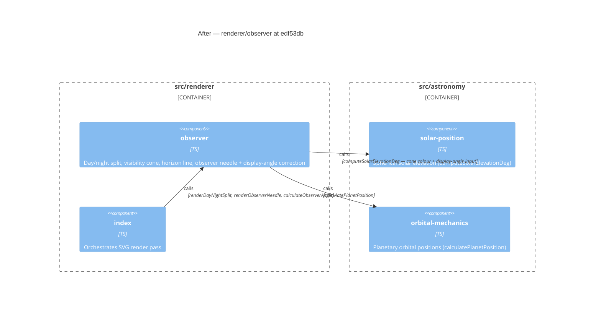

# Component Diagram (after)

**Base:** `904637a` — chore(deps-dev): bump prettier from 3.9.5 to 3.9.6 (dependabot[bot],
2026-07-25) **Head:** `edf53db` — fix(observer): align horizon with accurate elevation at high
latitudes (marcintk, 2026-07-25)

## Evidence

- `observer` — `src/renderer/observer.ts`: now also exports `computeDisplayObserverAngle` (new, line
  48). `renderDayNightSplit` calls it to derive `displayObserverAngle` when `locationData.lat` is
  present (line 183–188), using it for cone direction, horizon, and zenith lines.
- All external edges unchanged — `rendererIndex`, `solarPosition`, `orbitalMechanics`
  callers/callees are identical at both commits.
