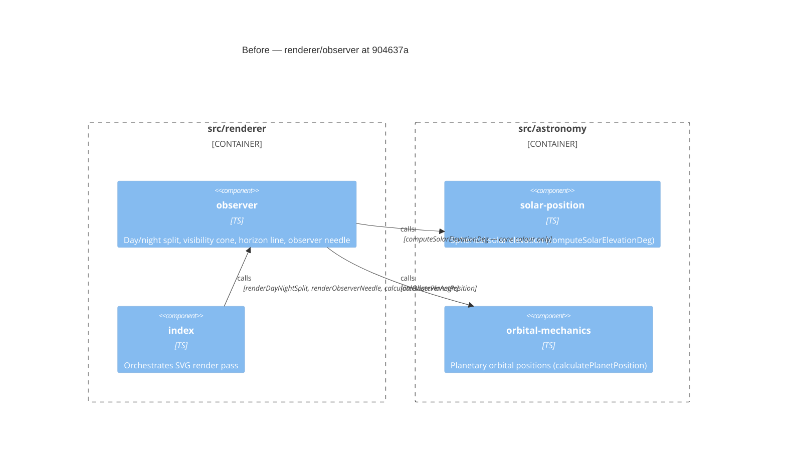

# Component Diagram (before)

**Base:** `904637a` — chore(deps-dev): bump prettier from 3.9.5 to 3.9.6 (dependabot[bot],
2026-07-25) **Head:** `edf53db` — fix(observer): align horizon with accurate elevation at high
latitudes (marcintk, 2026-07-25)

## Evidence

- `observer` — `src/renderer/observer.ts`: exports `rayCircleDistance`,
  `calculateSolarElevationDeg`, `calculateObserverAngle`, `renderDayNightSplit`,
  `renderObserverNeedle`.
- `rendererIndex` → `observer` — `src/renderer/index.ts:12`:
  `import { calculateObserverAngle, renderDayNightSplit, renderObserverNeedle }`.
- `observer` → `solarPosition` — `src/renderer/observer.ts:3,155`: `computeSolarElevationDeg` called
  inside `renderDayNightSplit` to determine cone colour; does **not** influence cone direction.
- `observer` → `orbitalMechanics` — `src/renderer/observer.ts:1,130`:
  `calculatePlanetPosition(EARTH, date)`.
