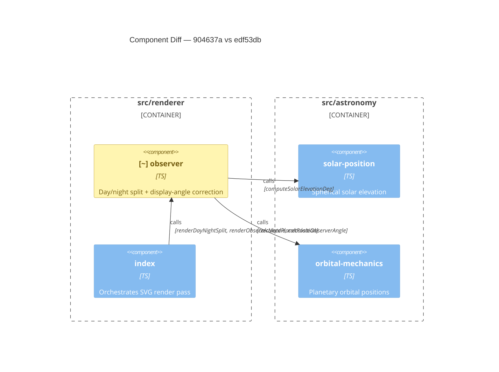

# Component Diagram (diff)

**Base:** `904637a` — chore(deps-dev): bump prettier from 3.9.5 to 3.9.6 (dependabot[bot],
2026-07-25) **Head:** `edf53db` — fix(observer): align horizon with accurate elevation at high
latitudes (marcintk, 2026-07-25)

## Legend

🟢 added 🔴 removed 🟠 changed ⚪ unchanged (context)

## Evidence

- 🟠 `observer` — `src/renderer/observer.ts`: new exported function `computeDisplayObserverAngle`
  (line 48). `renderDayNightSplit` now computes `displayObserverAngle` from accurate spherical
  elevation when `locationData.lat` is present (lines 183–188) and uses it for cone direction,
  horizon, and zenith lines instead of the raw 2D `observerAngle`.
- ⚪ All edges unchanged — no new imports, no new callers. `computeDisplayObserverAngle` is internal
  to `observer`; no external component gained a new dependency.

## Summary

One component changed: `observer` gained the `computeDisplayObserverAngle` export, which inverts the
2D elevation formula using accurate spherical astronomy to correct the visual horizon direction at
high latitudes. Nothing was removed. No cross-component relationships changed — the fix is entirely
self-contained within `observer.ts`, consuming the same `computeSolarElevationDeg` result that was
already being computed for cone colouring, now also feeding the cone and horizon direction.
